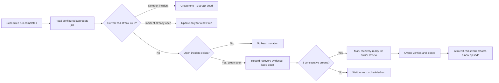

# Red Nightly Streak Visibility and Ownership Plan

Root bead: `ga-clmemp`  
Architecture source: `ga-hd99jq` D4 and AF-2  
Incident sources: `ga-wecoe1`, `ga-p658sc`, `ga-gxmz9n`  
Prepared: 2026-07-30

## Outcome

Build one parameterized nightly-health monitor and enroll both current
workflow families:

- `Mac Regression` → `Mac regression summary`
- `Nightly` → `Nightly summary`

The monitor runs as a scheduled local Gas City Order. It reads each scheduled
run's aggregate job conclusion, detects three consecutive non-success results,
and creates or updates one durable incident bead for that workflow. The bead is
routed to the configured investigator queue, so the streak becomes owned work
instead of another notification someone must remember to watch.

This is a reusable mechanism, not a Mac-only repair. The three independently
discovered incidents establish a class, while the two initial workflows keep
the first rollout bounded.

## Product policy

| Decision | Policy |
| --- | --- |
| Scope | One generic monitor with per-workflow enrollment records; do not create separate scripts for Mac Regression and Nightly |
| Verdict | Read the configured aggregate job's own conclusion for each scheduled run; never read the workflow run conclusion |
| Threshold | Open an incident on the third consecutive aggregate conclusion that is not `success` |
| Trigger | A local scheduled Order evaluates at least hourly and re-reads run history, so a restart or missed tick does not lose the streak |
| Persistence | GitHub remains the run-history source; beads remain the incident source. No counter, PID, lock, or status file is added |
| Active identity | At most one open red-streak episode bead per enrolled workflow |
| Ownership | Route each incident to a configuration-supplied target; the initial two enrollments use `gascity/investigator` |
| Priority | The initial enrollments create P1 incidents because a permanently red nightly masks later regressions |
| Recovery | A green result breaks an unopened streak. It records recovery evidence on an active incident but does not auto-close it |
| Closure | The routed owner confirms the cause is resolved before closing. Three consecutive greens mark the bead recovery-ready; they do not replace owner confirmation |
| Recurrence | If the workflow is still red after an incident is closed, or later reaches three reds again, create a new episode |

The one-hour evaluation target is an upper bound, not an instruction to poll in
a tight loop. Both workflows run daily, so this turns a threshold crossing into
same-day owned work while keeping GitHub API use small.

## Why the monitor runs locally

This rig's bead store is intentionally local-only. A GitHub-hosted runner can
invoke `bd`, but a bead created in that runner's ephemeral checkout is not a
durable bead in the live rig and cannot surface through the city's ordinary
work queries.

A local Order has the correct ownership boundary:

1. The orchestrator invokes a deterministic probe on a cooldown.
2. The probe reads GitHub through the existing `gh` authentication boundary.
3. It compares the configured threshold.
4. It creates or updates the incident through the live rig's bead store.
5. Existing route and nudge behavior wakes the configured owner.

This matches the platform's existing Order pattern and the local
`check-census-owner-liveness.sh` precedent: detect a factual condition, dedupe
against open beads, and materialize work without consuming an agent session.
It adds no new primitive.

## Aggregate-job contract

An enrolled workflow must provide exactly one configured aggregate job for
every scheduled run:

- The job uses `if: always()` and waits for every required workflow job.
- Its own conclusion is `success` only when every required scheduled job
  succeeded.
- A failed, cancelled, skipped, missing, or ambiguous required result cannot
  silently become success.
- The job publishes a per-job result table for investigation.

`Mac regression summary` is being corrected under `ga-n7ef4e` and its review
bead `ga-99n5nd`. `Nightly` has no aggregate job today, so
`ga-clmemp.3` adds `Nightly summary` before that workflow can be enrolled.

Every enrollment has an activation boundary. Historical runs before that
boundary may lack the new aggregate job and are excluded. A missing or
duplicate aggregate job after activation is a monitor/data-contract failure,
not a green verdict.

## Incident lifecycle



Repeated hourly observations of the same latest run are no-ops. A newly
completed run may update the active bead once with the streak length, first
and latest run identifiers and URLs, aggregate job identity, and recovery
evidence.

Closing is deliberately owner-confirmed. A lone green can be a transient
recovery, while closing an incident is a statement that someone has examined
the underlying cause. If someone closes while the latest three scheduled runs
are still red, the next evaluation creates a new episode rather than allowing
manual closure to silence the signal.

## Work packages

| Order | Bead | Route | Purpose |
| --- | --- | --- | --- |
| 1 | `ga-clmemp.1` | `needs-architecture` → `gascity/architect` | Specify the trusted local execution boundary, enrollment contract, failure semantics, and implementation test seams |
| 2 | `ga-clmemp.2` | `needs-tests` → `gascity/validator` | Author failing contracts for aggregate verdicts, streak evaluation, idempotency, multi-workflow isolation, and incident recovery |
| 3 | `ga-clmemp.3` | `ready-to-build` → `gascity/builder` | Add the always-run `Nightly summary` aggregate required by D5 |
| 4 | `ga-clmemp.4` | `ready-to-build` → `gascity/builder` | Implement the parameterized scheduled monitor and bead episode lifecycle |
| 5 | `ga-clmemp.5` | `ready-to-build` → `gascity/builder` | Enroll Mac Regression and Nightly, prove historical detection, and add the contributor response runbook |

Dependency graph:

```text
ga-clmemp.1
  -> ga-clmemp.2
       -> ga-clmemp.3
       -> ga-clmemp.4

ga-clmemp.3 ----\
ga-clmemp.4 -----+-> ga-clmemp.5
ga-99n5nd -------/
```

The architecture package is first because the live bead writer and GitHub
reader must share a trusted local boundary. Validator work follows that
contract, and both implementation packages follow the validator to preserve
TDD. Final enrollment waits for both aggregate jobs and the generic monitor.

## Acceptance summary

The program is complete when:

- a third consecutive red scheduled run becomes an owned P1 bead within one
  hour;
- Mac Regression and Nightly use the same parameterized mechanism;
- the result is derived from each run's configured aggregate job, including a
  fixture where the workflow conclusion disagrees;
- a historical replay shows Mac Regression would have surfaced by 2026-07-05
  rather than after 27 runs;
- a replay of the Nightly three-run sample surfaces the `ga-p658sc` condition;
- repeated evaluation of the same run creates no duplicate bead or duplicate
  update;
- the mechanism recovers after restart without a counter or status file;
- one green never auto-closes an active incident;
- recovery-ready evidence reaches the configured owner, and recurrence creates
  a new episode;
- API, authentication, parse, and aggregate-contract failures are visible and
  never recorded as green;
- neither generic Go nor generic configuration hardcodes a workflow or agent
  role;
- the relevant focused tests, repository test shards, `go vet ./...`, docs
  checks, and active pre-commit hook all pass; and
- every implementation branch is reviewed, merged, and verified against the
  live local Order.

## Risks and controls

| Risk | Control |
| --- | --- |
| A GitHub-hosted workflow creates an ephemeral bead that never reaches the rig | Keep the writer in the local Order execution boundary |
| The monitor repeats F5 by reading the workflow conclusion | Contract fixtures force a divergent workflow/job result and assert the job result wins |
| Hourly polling creates duplicate incidents or noisy updates | Stable workflow episode identity plus latest-observed-run idempotency |
| Pre-rollout history lacks an aggregate job | Per-enrollment activation boundary; post-activation absence fails visibly |
| A single lucky green closes an unresolved flaky incident | Record recovery without automatic closure; require owner confirmation |
| The generic mechanism grows workflow-specific branches | All workflow identity, aggregate job, threshold, priority, and route values come from enrollment configuration |
| The local orchestrator is down during a nightly | Every evaluation backfills GitHub history rather than relying on an in-memory event |
| A manually closed incident hides an unchanged red workflow | A still-red threshold creates a new episode on the next evaluation |

## Out of scope

- Fixing `ga-p658sc` or `ga-gxmz9n`
- Changing Mac Regression required-check membership
- Touching ruleset 14017226
- Rebuilding the `ga-n7ef4e` gate and summary change
- Adding Checks API writes or a new notification service
- Using workflow-run top-level conclusions as a fallback verdict
- Adding a new persistence database or a status/counter file
- Creating a new platform primitive instead of composing an Order and beads

## Planning-system note

The repository moved internal PM artifacts to `engdocs/plans` in `512b066e8`.
The active PM prompt still names `docs/plans`; open bead `ga-f74ph9.1` owns that
pack-level correction. The public `docs/` tree rejects unpublished engineering
plans through `TestEveryDocsPageIsPublished`, so this artifact follows the
current repository decision and is committed from `engdocs/plans`.
